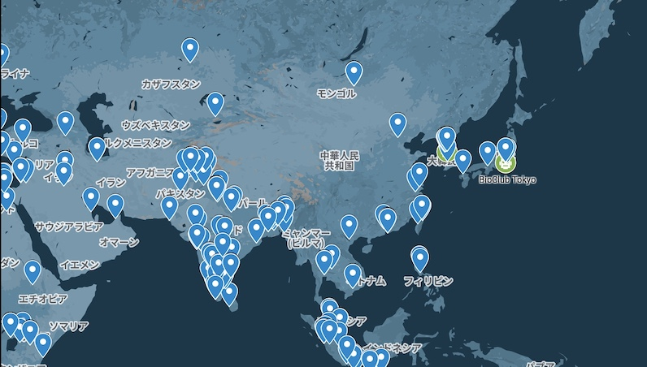

+++
title = 'Index'
draft = false
+++

Welcome to the HTGAA@BioClub Site! [BioClub Tokyo](https://bioclub.tokyo) is one of the Global Nodes of the growing HTGAA Network. Lectures and Recitations are shared globally from the MIT Course 'How to Grow Almost Anything', each node will organize additional Class & Homework Reviews sessions, as well as hands-on experiments in the lab of the local node.


*Committed Listeners* are expected to watch and particate in all Weekly Classes, Recitations and Reviews.  
CLs are also required to atttend ***at least 33%*** of all BioClub Node Meetings.


# Upcoming 

|      |      |
| :--- | :--- |
| **BioClub Recitation #3 Review** | Thursday, February 19th, 21:00 - 22:00 JST |
| **BioClub Homework #3 Review** | Monday, February 23rd, 21:00 - 22:00 JST |
| **Global Class #4**| Tuesday, February 24th, 2-5PM EST |
| **Global Recitation #4** | Wednesday, February 25th, 5-7PM EST |

_Classes & Recitations are held on the HTGAA 26 Zoom, BioClub Reviews on the [BioClub Zoom](https://zoom.bioclub.tokyo)_.

# Meeting Times

### Global Schedule

- **Class:** Tuesdays 14:00-17:00 ET at MIT Zoom
- **Recitation:** Wednesdays 17:00-18:00 ET at MIT Zoom

###  BioClub Schedule

- **BioClub Tokyo Class Reviews:** Thursdays 21:00-22:00 JST at [BioClub Zoom](https://zoom.bioclub.tokyo)
- **BioClub Tokyo Homework Reviews:** Mondays 21:00-22:00 JST at [BioClub Zoom](https://zoom.bioclub.tokyo)

[HTGAA 2026 Google Calendar](https://calendar.google.com/calendar/u/0?cid=MThiZWVjNDg4ZTBmYTU1Njg3MmJjZGI1NjVjZTYwYTAxMWMxNTdlMjM0Y2FlZjkxZjc3ZDY1ZTA0YjQyMjEzMUBncm91cC5jYWxlbmRhci5nb29nbGUuY29t) with all the Bootcamp, Office Hours, Classes and Node Meeting Times.

# Recordings

All the information, including homework assignments, recordsings, and slides will be shared on the [HTGAA 2025 Website](https://2026a.htgaa.org). The table below also includes recordings of the BioClub Node Reviews.

|    Week    |  Class¹ | Recitation¹ | Class Review² | Homework Review² |
| :--------- | :------ | :---------- | :------------ | :--------------- |
| [Week 1](https://2026a.htgaa.org/2026a/course-pages/weeks/week-01/)  | [📼Recording](https://mit.zoom.us/rec/share/C43WV58egtd4n05TD_aI1KA7_hspIt1Dlq9UcCEfImSxvhp35FwI-IyIKssNbUef.G9Bl0_zkLJRca4RZ) | [📼Recording](https://mit.zoom.us/rec/share/kgR29Xks7fOXkzhgff6QPXoEGqa1-9jITK6pj44sBwky728XF8revY-lfFPDx69L.5NhD1v4zzQ4HItQi?startTime=1770243177000) | [📼Recording](https://vimeo.com/1162175019) | [📼Recording](https://vimeo.com/1163253601) |
| [Week 2](https://2026a.htgaa.org/2026a/course-pages/weeks/week-02/)  | [📼Recording⁴](https://mit.zoom.us/rec/play/xKIjPzfSJtJuymsKI7cIE80a77YO4SYOAd0Z2uQOYN9zu9A6DgG1cOTtAu1DcBey6Ba9RX3-PtpQ8fbA.NfYtPot9DyZPsufT) | [📼Recording](https://mit.zoom.us/rec/play/M68Rn1U_zUmBAFHjCY4earkmXaP1TSKRWxg3b4ALSKnGlJMSKSow2FMWF8deT7PvLY01L_Csm5W6bx7I.vbVNRfogAy-PQ6IX) | [📼Recording](https://vimeo.com/1164347975) | [📼Recording](https://vimeo.com/1165354751) |
| [Week 3](https://2026a.htgaa.org/2026a/course-pages/weeks/week-03/)  | *No Class* | [📼Recording](https://mit.zoom.us/rec/share/a3jueEw2GphFkLZgd-qI8Q702kW4bXMtfueZnW-WKenH2Nr5s_3YqAqCiHQHOoi3._npA5H5sqxfSOVU1) |           |           |
| [Week 4](https://2026a.htgaa.org/2026a/course-pages/weeks/week-04/)  |           |           |           |           |
| [Week 5](https://2026a.htgaa.org/2026a/course-pages/weeks/week-05/)  |           |           |           |           |
| [Week 6](https://2026a.htgaa.org/2026a/course-pages/weeks/week-06/)  |           |           |           |           |
| [Week 7](https://2026a.htgaa.org/2026a/course-pages/weeks/week-07/)  |           |           |           |           |
| Week 8 | *No Class* | *No Recitation* |           |           |
| [Week 9 ](https://2026a.htgaa.org/2026a/course-pages/weeks/week-09/) |           |           |           |           |
| [Week 10](https://2026a.htgaa.org/2026a/course-pages/weeks/week-10/) |           |           |           |           |
| [Week 11](https://2026a.htgaa.org/2026a/course-pages/weeks/week-11/) |           |           |           |           |
| [Week 12](https://2026a.htgaa.org/2026a/course-pages/weeks/week-12/) |           |           |           |           |
| [Week 13](https://2026a.htgaa.org/2026a/course-pages/weeks/week-13/) |           |           |           |           |
| [Week 14](https://2026a.htgaa.org/2026a/course-pages/weeks/week-14/) |           |           |           |           |

<small>
¹ Global HTGAA Course, ² BioClub Tokyo-organised Reviews, ³ In Progress…, ⁴ Recording from 2025 
All recordings are Password-protected. Check your email or the <a href="https://forum.htgaa.org">HTGAA Forum</a> for access.
</small>

# Global Bio Bootcamp

Prior to the start of the HTGAA we will organise a [Bio Bootcamp](2026/bootcamp), to get everyone oriented and up to speed. It is recommened for everyone. [Watch the recording and catch up with the slides](2026/bootcamp).

# Applicant & Node Map

A [Map](2026/map) showing the locations of Applicants & Nodes.

# BioClub Global TAs

Will be published after Class #2 (soon).

# BioClub Committed Listeners

## Committed Listener Milestones

### Milestone 1

Congratulations for submitted the HW1 on time, and becoming a Committed Listener. That was Milestone 1.

### Milestone 2

In order to reach Milestone 2 and continue being a Committed Listener at BioClub, you need to do the following until March 10th 2pm ET.

- [ ] Make HW 1-5. We understand that finishing HW 100% is difficult, but you need to have some content for each week. Having no content (or non-working links) means you did not do the HW.
- [ ] Attend at least 33% of BioClub Review Meetings. Week 1 will not count, as you were not officially assigned to a node year. We will calculate attendance from Week 2 - Weeke 5.
- [ ] Share your 3 Project Ideas on the Shared CL Slide Deck - and on your website
- [ ] Send a message in the [BioClub Category](https://forum.htgaa.org/c/bioclub/19) on the Forum
- [ ] Send a message in the [BioClub Chat](https://forum.htgaa.org/chat/c/bioclub/16) on the Forum

_No extension will be granted._

If you fail to meet these critera, you will be removed from the BioClub _Committed Listeners_.

Any questions? Ask in the Review Session or on the Forum.

### Current Committed Listeners

|                   |               |                |
| :---------------- | :------------ | :------------- |
| [Abrar Hasan](https://pages.htgaa.org/2026a-abrar-hasan)                               | [Ganapathi Naayagam](https://pages.htgaa.org/2026a-ganapathi-naayagam)                 | [Omama Syed](https://pages.htgaa.org/2026a-omama-syed)                         |
| [Achraf Chaddad](https://pages.htgaa.org/2026a-achraf-chaddad)                         | [Gargi Deshmukh ](https://pages.htgaa.org/2026a-gargi-deshmukh)                        | [Pooja Logasundaram](https://pages.htgaa.org/2026a-pooja-logasundaram)         |
| [Adriana Cabrera](https://pages.htgaa.org/2026a-adriana-cabrera)                       | [Hotaku Komatsu](https://pages.htgaa.org/2026a-hotaku-komatsu)                         | [Radi Khodr](https://pages.htgaa.org/2026a-radi-khodr)                         |
| [Afifah Nurul Ilmi](https://pages.htgaa.org/2026a-afifah-nurul-ilmi)                   | [Jamie Huang](https://pages.htgaa.org/2026a-jamie-huang)                               | [Rafi Ramadhan Anwar](https://pages.htgaa.org/2026a-rafi-ramadhan-anwar)       |
| [Alan Bravo](https://pages.htgaa.org/2026a-alan-bravo)                                 | [João Neves](https://pages.htgaa.org/2026a-joao-neves)                                 | [Ritika Saha](https://pages.htgaa.org/2026a-ritika-saha)                       |
| [Alejandro Ortiz](https://pages.htgaa.org/2026a-alejandro-ortiz)                       | [Jobins John Cheria](https://pages.htgaa.org/2026a-jobins-john-cheria)                 | [Riu Yanagida](https://pages.htgaa.org/2026a-riu-yanagida)                     |
| [Andrei Vasilan](https://pages.htgaa.org/2026a-andrei-vasilan)                         | [Jorge Vilchez](https://pages.htgaa.org/2026a-jorge-vilchez)                           | [Ryan Zukhri](https://pages.htgaa.org/2026a-ryan-zukhri)                       |
| [Angela Sunaryo](https://pages.htgaa.org/2026a-angela-sunaryo)                         | [Katharine Kolin](https://pages.htgaa.org/2026a-katharine-kolin)                       | [Saba Saeed](https://pages.htgaa.org/2026a-saba-saeed)                         |
| [Anushka Shinde](https://pages.htgaa.org/2026a-anushka-shinde)                         | [Keerthana Gunaretnam](https://pages.htgaa.org/2026a-keerthana-gunaretnam/)            | [Sami Ur Rehman](https://pages.htgaa.org/2026a-sami-ur-rehman)                 |
| [Arkadyuti Ghorai](https://pages.htgaa.org/2026a-arkadyuti-ghorai)                     | [Liam Edwards-Playne](https://pages.htgaa.org/2026a-liam-edwards-playne)               | [Samriddh Sadhukhan](https://pages.htgaa.org/2026a-samriddh-sadhukhan)         |
| [Arucha Khematharonon](https://pages.htgaa.org/2026a-arucha-khematharonon)             | [Lit Liao](https://pages.htgaa.org/2026a-lit-liao)                                     | [Samudera Mukhalid](https://pages.htgaa.org/2026a-samudera-mukhalid)           |
| [Ashish Srivastava](https://pages.htgaa.org/2026a-ashish-srivastava)                   | [Luz Mariana Perez Resendiz](https://pages.htgaa.org/2026a-luz-mariana-perez-resendiz) | [Sayaka Shimada](https://pages.htgaa.org/2026a-sayaka-shimada)                 |
| [Ashly Gutierrez Urquidi](https://pages.htgaa.org/2026a-ashly-juana-gutierrez-urquidi) | [Maria Darabus ](https://pages.htgaa.org/2026a-maria-darabus)                          | [Shahtaj Nazmeen](https://pages.htgaa.org/2026a-shahtaj-nazmeen)               |
| [Bihar Hikam Ahmadi](https://pages.htgaa.org/2026a-bihar-hikam-ahmadi)                 | [Mariana Kanbe](https://pages.htgaa.org/2026a-mariana-kanbe)                           | [Sheila Ramani](https://pages.htgaa.org/2026a-sheila-ramani)                   |
| [Callum Siegmund](https://pages.htgaa.org/2026a-callum-siegmund)                       | [Marisa Satsia](https://pages.htgaa.org/2026a-marisa-satsia)                           | [Shishir Nair](https://pages.htgaa.org/2026a-shishir-nair)                     |
| [Casian Veselin](https://pages.htgaa.org/2026a/casian-veselin)                         | [Maryam Farhan](https://pages.htgaa.org/2026a-maryam-farhan)                           | [Shruti Pawar](https://pages.htgaa.org/2026a-shruti-pawar)                     |
| [Ceren Ozgen](https://pages.htgaa.org/2026a-ceren-ozgen)                               | [Md. Ashraful Islam](https://pages.htgaa.org/2026a-md-ashraful-islam)                  | [Silfani Febriernita](https://pages.htgaa.org/2026a-silfani-febriernita)       |
| [Charley Naney](https://pages.htgaa.org/2026a-charles-naney)                           | [Muhammad Ilham](https://pages.htgaa.org/2026a-muhammad-ilham)                         | [Sophia Irina Harcău](https://pages.htgaa.org/2026a-sophia-irina-harcau)       |
| [Christine Zhou](https://pages.htgaa.org/2026a-christine-zhou)                         | [Muhammad Shaiq Paracha](https://pages.htgaa.org/2026a-muhammad-shaiq-paracha)         | [Sude Tanım](https://pages.htgaa.org/2026a-sude-tanim)                         |
| [Deep Dalvi](https://pages.htgaa.org/2026a-deep-dalvi)                                 | [Muzzammil Mulla](https://pages.htgaa.org/2026a-muzzzammil-mulla)                      | [Sujoy Mahmud](https://pages.htgaa.org/2026a-sujoy-mahmud)                     |
| [Devayan Das](https://pages.htgaa.org/2026a-devayan-das)                               | [Nanditha Nair](https://pages.htgaa.org/2026a-nanditha-nair)                           | [Supanat Deawrattanakun](https://pages.htgaa.org/2026a-supanat-deawrattanakun) |
| [Diogo Custódio](https://pages.htgaa.org/2026a-diogo-custodio)                         | [Nathaniel Nainggolan ](https://pages.htgaa.org/2026a-nathaniel-nainggolan)            | [Taliana Vyaltseva](https://pages.htgaa.org/2026a-taliana-vyaltseva)           |
| [Ednah Wanjiru](https://pages.htgaa.org/2026a-ednah-wanjiru)                           | [Nipada Srisereenuwat](https://pages.htgaa.org/2026a-nipada-srisereenuwat)             | [Tomoki Oshita](https://pages.htgaa.org/2026a-tomoki-oshita)                   |
| [Fabrizio Flores Huamán](https://pages.htgaa.org/2026a-fabrizio-flores-huaman)         | [Nourelden Rihan](https://pages.htgaa.org/2026a-nourelden-rihan)                       | [Vova Manannikov](https://pages.htgaa.org/2026a-vova-manannikov)               |
| [Flo Razoux](https://pages.htgaa.org/2026a-flo-razoux)                                 | [Om Wakade](https://pages.htgaa.org/2026a-om-wakade)                                   | [Yuxin Wang](https://pages.htgaa.org/2026a-yuxin-wang)                         |

<!-- Participations [Statistics](2026/participation) -->

# Communications

Committed Listeners and TAs should use the [BioClub Category](https://forum.htgaa.org/c/bioclub/19) and the [BioClub Chat](https://forum.htgaa.org/chat/c/bioclub/16) on the new HTGAA Forum.

# _Committed Listener vs Global Listener?_

A **Committed Listener** is a Listener that commits to the course. CLs are expected to:

- **Watch every Class & Recitation**
- **Submit the Weekly Homework in time**
- **Participate actively in the Node Review Sessions**
- **Do and present a _Final Project_**

CLs will get access to the Global TAs, to the git-based Documentation Server, and to the HTGAA-internal Sommunication Servers. If a CLs completes all the homework, has recorded sufficient attendance and presented a Final Project, they are elegible for a *Certificate of Completion*.

The time budget needed for a CL is about 15-20 hours / week.

**Global Listeners** are welcome to watch the Lectures and Recitations and they are welcome to make the Homework on the own time. They can not get *Certificate of Completion*. 
We understand, that the content is dense and complex, and doing the homework takes time and energy.Many HTGAA participants take more than one cycle to complete the course.

# About HTGAA 2026 @BioClub Tokyo

Welcome to How To Grow (Almost) Anything 2026 at BioClub Tokyo!

This page is for students who are interested in participating in online review sessions and/or in-person experiments for HTGAA 2026 at BioClub Tokyo in Japan.

We also aim to perform the same hands-on laboratory work as the students at MIT & Harvard!

<!--

This is an overview of the classes, recitations and BioClub review recordings. For more detailed info about homework and reading lists, please visit the [2025 HTGAA Main Site](https://2025.htgaa.org/).

|            |  Class¹ | Recitation¹ | Class Review² | Homework Review² |
| :--------- | :------ | :---------- | :------------ | :--------------- |
|     | [🟢](https://mit.zoom.us/rec/play/Xm_LMBekTFFjCIcgnFbCAfli-EM3nSC_MZEY_JcaowB-TrtmAZwXZnoeOH8ZWL48gisiF7YJ7OxL0awA.hJLtkswqI8CjZuVy) | [🟢](https://mit.zoom.us/rec/play/-2ZdE0XqOFBX1SPmTzWj2MRdN5XyHZuQgMzR7-hTTcs8kr3j2WuZoE6Y-_oTqBFelUqtyPvlzGT2n7yd.5f88HBwfElZIbLXu) | [🔐](https://vimeo.com/1054354645) | [🔐](https://vimeo.com/1054354645) |
| Class 2    | [🟢](https://mit.zoom.us/rec/play/xKIjPzfSJtJuymsKI7cIE80a77YO4SYOAd0Z2uQOYN9zu9A6DgG1cOTtAu1DcBey6Ba9RX3-PtpQ8fbA.NfYtPot9DyZPsufT) | [🟢](https://mit.zoom.us/rec/play/8G5JKxUGQhk0-TQm68vuJMAZsDbM7gxnBnVhfa1EkqYJvZiye0rwC2u_ykyyF-Ua1DN8JhdyJHOi6e-C.mBawL7GQ5rZ89jLu) | [🔐](https://vimeo.com/1056622082?share=copy) | [🔐](https://vimeo.com/1057505242) |
| Class 2.5  | ❌ ³ |             |               |                  |

<small>*¹ Global HTGAA Course*  
*² BioClub Tokyo-organised Class & Homework recordings will not be shared publicly, please join a session in-person to get access.*  
*³ No Class this week*  
*⁴ Preparing…*  </small>

[Chat Notes](notes) from the Review Sessions.

# BioClub Tokyo *Global TAs*


  
  [Cholpisit Ice Kiattisewee](https://www.notion.so/fe2dd3f72567457394f07f214ce5dd94?pvs=21)  
  [Elaine Regina]()  
  [Georg Tremmel]()  
  
  
  [Mario Nakahara]()  
  [Paul Kao]()  
  [Qurat.ul.(Ainy) Danish]()  
  
  
  [Thanakrit Austin Wongsatit]()  
  *Anyone else?*  
  


# BioClub Tokyo *Committed Listeners*


  
  [Alireza Hekmati](https://www.notion.so/190b4ef4a4a38003aee4f2ad6cf5b57c?pvs=21)  
  [Anandita Amalia](https://www.notion.so/1344f5c4dadc8020bfb0f428bb716978?pvs=21)  
  [Anushka Shinde](https://www.notion.so/191dc39b964a805dbeadc59a686913fd?pvs=21)  
  [Aprajita Shukla](https://www.notion.so/1978ba87ad7f8005a3b8d82d09b2fe20?pvs=21)  
  [Arisa Tani](https://www.notion.so/192b2e8b2656809ca67cf6804088708d?pvs=21)  
  [Aryan Choudhary](https://www.notion.so/19122a4f4199807ba9a8d3e814c4adbe?pvs=21)  
  [Azmine Toushik Wasi](https://www.notion.so/1954d7794a988030930fdc70b988f33e?pvs=21)  
  [Chairunnisa Amanda](https://www.notion.so/193f81ba50a880178496cc1c83c1f16e?pvs=21)  
  [Dr. Data Cheuk Kwong Ng](https://www.notion.so/195c79e79e59809c91becf3a92956335?pvs=21)  
  [Elif Dilan Gündüz](https://www.notion.so/1979e70c781080289581e17ee1b3a95d?pvs=21)  
  [Farhani Syafwani](https://www.notion.so/19234e98711580809b16ee6a666dc3ca?pvs=21)  
  
  
  [Hansen Jonathan](https://www.notion.so/198944042f0e805c96aedb60a622130b?pvs=21)  
  [Kavya Sreekanth](https://www.notion.so/190da404c0c88062bee2c1718c358096?pvs=21)  
  [Kian Ghaempanah](https://www.notion.so/1906a20e7b5f80b78b34c58ac1772d06?pvs=21)  
  [Md Rasel Uddin](https://www.notion.so/19301748a46b80d4bfadd69c9bec140e?pvs=21)  
  [Mridul Kaimal](https://www.notion.so/196acb58c03580a2838df57652607c90?pvs=21)  
  [Muhammad Algifari](https://www.notion.so/d77d4f8b6f7a4a0e8fdbce4a8b07c196?pvs=21)  
  [Mustapha Yusuph](https://www.notion.so/1933e020c0df80f89b71c22e45b86ac1?pvs=21)  
  [Muzzammil](https://www.notion.so/19842536bdf78010bfd0f72374914bf7?pvs=21)  
  [Nina Kurowska](https://www.notion.so/1926e5125f1a8075b71af1e28ef05988?pvs=21)  
  [Nipada Srisereenuwat](https://www.notion.so/1959cfcc6b8b801588f5e744773d7005?pvs=21)  
  [Rebecca Zhang](https://www.notion.so/1975cd7b7e2980819f95fd6d822fb2fb?pvs=21)  
  
  
  [Rolando Saavedra](https://www.notion.so/1904b1eccdd8801ca686d7f7983d680c?pvs=21)  
  [Rosalea Matta](https://www.notion.so/191c10fd86938012ac44de32932f570a?pvs=21)  
  [Rushda Parveen](https://www.notion.so/192e2e92f2ca803c856cd42bc6b40110?pvs=21)  
  [Salsabila Fitriya](https://www.notion.so/1970df7c11fc8048a23ef0063c077178?pvs=21)  
  [Samudra Ilham](https://www.notion.so/1967051d92d98031bc61fa49437aa2ab?pvs=21)  
  [Sayaka Shimada](https://www.notion.so/18fc7dce2b2180f4b527d1a292e41974?pvs=21)  
  [Shaban Muhammad](https://www.notion.so/195f389290fa80d8bb41cbde3c5d5016?pvs=21)  
  [Talal Almojel](https://www.notion.so/1950577dc2f08068b8d4c5d3d9cedb9f?pvs=21)  
  [Yash Sawant](https://www.notion.so/1950368657b8809e87e6ca0a61d5120a?pvs=21)  
  [Xinyao Ma](https://www.notion.so/197bd522f3f480669868e63abc4ebe7c?pvs=21)  
  


*Committed Listeners from other nodes. Everyone is welcome to join the BioClub Review Sessions!*


  
  [Ahmad Hader](https://www.notion.so/197d6b6e64f1800f93b8d85fd3c21752?pvs=21)  
  [Ioana Ferariu](https://www.notion.so/1969e50382868007af9ccd9e0564b711?pvs=21)  
  
  
  [Pranati Das](https://www.notion.so/1935ec67123280eb926bf996afb878d5?pvs=21)  
  [Yousif Graytee](https://www.notion.so/192b0240d1fa80fba0fac3da18ffed24?pvs=21)  
  
  
  [Xavier Rios](https://www.notion.so/196cfcb3c1768032b82bda15f6659172?pvs=21)  
  



If you name is not on this list, it means you either have not joined a BioClub Session or you did not make a Slack Account. Please ping me at **#2025-nodes-bioclub** once you have your Slack Account. We will then add you to the list.


# BioClub Tokyo Node Info

[BioClub Node Info](info)

-->
# BioClub Tokyo *In-Person Study Meetings*

In-person meetings & workshops at BioClub in Tokyo are to be determined. Please check the [BioClub Discord](https://discord.bioclub.tokyo) `#htgaa` channel for details.

# Laboratory Exercises

*Updates for 2026 forthcoming.*

We aim to conduct the same experiments at the main HTGAA course at MIT/Harvard. Stay tuned for ways to participated.

# Lab & Material Fees at BioClub Tokyo

Participation in the Global HTGAA online course is free of charge. If you want to conduct hands-on experiments at BioClub Tokyo we will ask you to financially contribute to the reagents and materials.

For the 2026 course we will split the hands-on experiment into separate workshops. The participation fee for each workshop depends on the reagents and materials needed to run the workshops.

Workshop times can be adjusted to the availability of Committed Listeners at BioClub Tokyo.

# Questions & Answers

- **日本語で参加できますか？**  
講義と宿題は英語で書く必要がある。日本語での会話は可能ですが、主なコミュニケーション言語は英語になります。

- **Can I join the HTGAA experiments for free?**  
You can join the Global HTGAA for free, but for the experiments at BioClub you need to contribute financially so we can cover the materials, reagents and instructor time.

- **Do I need to be a Committed Listener to participate in the experiments?**
You don’t need to be a Committed Listener, but it is highly recommended. The learning curve is quite steep, if you don’t have an bio background expect to study for about 20-30 hours/week.

- **How is HTGAA related to HTMAA & FabAcademy?**
HTGAA shares its ideas and goal with HTMAA and the FabAcademy. HTGAA uses a different structure, participation in the global course is free - where participation in the FabAcademy costs $5,000. (~¥780,000 in 2026/1).

- **Why is there no HTGAA Asia & Oceania in 2026?**
The HTGAA Asia & Oceania Review sessions in 2024 were a self-organised response to the chanllenging lecture times of the main HTGAA lectures and recitation, organised by Georg (BioClub Tokyo), Austin & Elaine.
For 2026 the concept of Global HTGAA nodes was introduced, BioClub Tokyo is one of these nodes. We will continue organising Class & Homework reviews, only for 2026 they are called BioClub Tokyo Class & Homework Reviews, instead of HTGAA Asia Class & Homework Reviews.

<!--

# Application Form for [HTGAA 2026](https://2026a.htgaa.org/ )

David Kong shared the [Application Form](https://forms.gle/CHt6Vd3FPgRU9zXp8) for the [*How to Grow (Almost) Anything 2026*](https://2026a.htgaa.org/) Course on his [Instagram](https://www.instagram.com/p/DTIx5mvgBgr/), [X](https://x.com/davidsunkong/status/2008282342087934353) and [LinkedIn](https://www.linkedin.com/posts/davidsunkong_syntheticbiology-htgaa-synbio-activity-7414010660658946049-xWM9/?utm_source=social_share_send&utm_medium=member_desktop_web&rcm=ACoAAADTOVcBe1e_ZpiJ2AotNm5FnUIlRuXWV44) accounts.


[Application Form](https://forms.gle/CHt6Vd3FPgRU9zXp8), Deadline: January ~~16th~~ ~~23rd~~ 31st  2026, 23:59 ET
Course Start: February 3rd 2026, 2pm ET


Please take your time and think carefully about your **Statement of Interest** in the Application Form. We want to know:

 - *Why do you want to be a part of this course?*
 - *What do you hope to get out of it?* 
 
Please make use of the 2000 characters and please don't write short or AI-generated responses. These *Statements* **will** be read by the Global TAs and Course Organizers, if we feel - based on the **Statement of Interest** - that the applicant is not a good fit for the course, we will not accept them.

## Application Timeline

1. Submit Application Form in time!
2. ~~Participate~~ Watch [Bio Bootcamp](2026/bootcamp) Recordings (optional)
3. Come to Class #1 on **February 3rd, 2-5PM EST** (mandatory)
4. Do Homework until Class #2 → if (submitted on time && OK) → ***Committed Listener***
5. No Homework → ***Global Listener***

*Attendance will be taken at Classes, Recitations and Node Reviews.*

-->